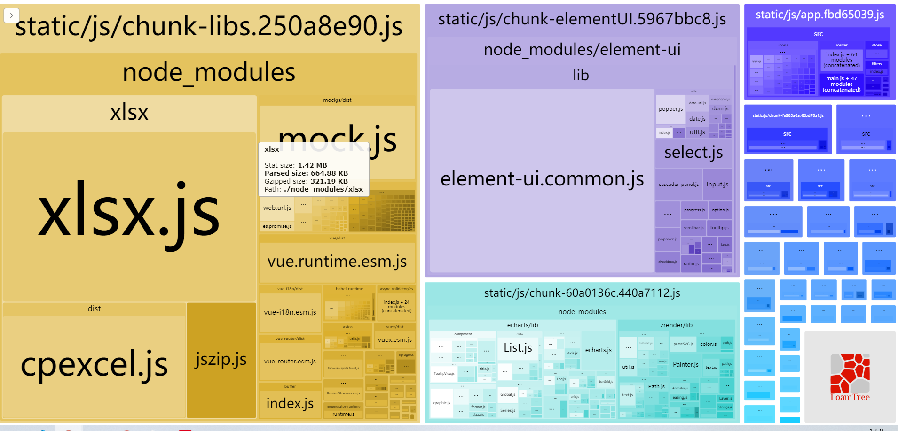

## **打包之前的路由模式**

**`目标`**配置打包之前的路由模式

> 在SPA单页应用中，有两种路由模式

**hash模式** ： #后面是路由路径，特点是前端访问，#后面的变化不会经过服务器

**history模式**：正常的/访问模式，特点是后端访问，任意地址的变化都会访问服务器

> 开发到现在，我们一直都在用hash模式，打包我们尝试用history模式

改成history模式非常简单，只需要将路由的mode类型改成history即可

```js
const createRouter = () => new Router({
  mode: 'history', // require service support
  scrollBehavior: () => ({ y: 0 }), // 管理滚动行为 如果出现滚动 切换就让 让页面回到顶部
  routes: [...constantRoutes] // 改成只有静态路由
})
```

> 假设我们的地址是这样的  **`www.xxxx/com/hr`**/a **`www.xxxx/com/hr`**/b

我们会发现，其实域名是**`www.xxxx/com`**，hr是特定的前缀地址，此时我们可以配置一个base属性，配置为hr

`router/index.js`

```js
const createRouter = () => new Router({
  mode: 'history', // require service support
  base: '/hr/', // 配置项目的基础地址
  scrollBehavior: () => ({ y: 0 }), // 管理滚动行为 如果出现滚动 切换就让 让页面回到顶部
  routes: [...constantRoutes] // 改成只有静态路由
})
```

此时，我们会发现地址已经变成我们想要的样子了


**提交代码**

## 性能分析和CDN的应用

**`目标`**： 对开发的应用进行性能分析和CDN的应用

### 性能分析

> 我们集成了 功能，写了很多组件，最终都会打包成一堆文件，那么真实运行的性能如何呢？

我们可以使用vue-cli本身提供的性能分析工具，对我们开发的所有功能进行打包分析

它的应用非常简单

```bash
$ npm run preview -- --report
```

这个命令会从我们的**`入口main.js`**进行依赖分析，分析出最大的包，方便我们进行观察和优化

执行完这个命令，我们会看到如下的页面



如图所以，方块越大，说明该文件占用的文件越大，文件越大，对于网络带宽和访问速度的要求就越高，这也就是我们优化的方向

> 像这种情况，我们怎么优化一下呢

### webpack排除打包

CDN是一个比较好的方式

> 文件不是大吗？我们就不要把这些大的文件和那些小的文件打包到一起了，像这种xlsx,element这种功能性很全的插件，我们可以放到CDN服务器上，一来，减轻整体包的大小，二来CDN的加速服务可以加快我们对于插件的访问速度

**使用方式**

先找到 `vue.config.js`， 添加 `externals` 让 `webpack` 不打包 `xlsx` 和 `element`   

**`vue.config.js`**

```js
configureWebpack: {
    // provide the app's title in webpack's name field, so that
    // it can be accessed in index.html to inject the correct title.
    name: name,
   // externals: externals,
    resolve: {
      alias: {
        '@': resolve('src')
      }
    }
  // 排除 elementUI xlsx  和 vue 
  externals:
      {
        // key(是要排除的包名):value(实际上是实际引入的包的全局的变量名)
        // 因为要排除element-ui，所有后面要引入CDN文件，CDN文件中有ELEMENTUI的全局变量名
        // externals首先会排除掉 定义的包名，空出来的位置，会用变量来替换
        'vue': 'Vue',
        'element-ui': 'ELEMENT',
        'xlsx': 'XLSX'
     }
  },
```

再次运行，我们会发现包的大小已经大幅减小

### CDN文件配置

> 但是，没有被打包的几个模块怎么处理？

可以采用CDN的方式，在页面模板中预先引入

**`vue.config.js`**

```js
 cdn = {
    css: [
      // element-ui css
      'https://cdn.bootcdn.net/ajax/libs/element-ui/2.15.13/theme-chalk/index.min.css' // 样式表
    ],
    js: [
      // vue must at first!
      'https://lf9-cdn-tos.bytecdntp.com/cdn/expire-1-M/vue/2.6.14/vue.min.js', // vuejs
      // element-ui js
      'https://cdn.bootcdn.net/ajax/libs/element-ui/2.15.13/index.min.js', // elementUI
      'https://cdn.jsdelivr.net/npm/xlsx@0.16.6/dist/jszip.min.js',
      'https://cdn.jsdelivr.net/npm/xlsx@0.16.6/dist/xlsx.full.min.js'
    ]
  }
```

> 但是请注意，这时的配置实际上是对开发环境和生产环境都生效的，在开发环境时，没有必要使用CDN，此时我们可以使用环境变量来进行区分

```js
// If your port is set to 80,
// use administrator privileges to execute the command line.
// For example, Mac: sudo npm run
// You can change the port by the following methods:
// port = 9528 npm run dev OR npm run dev --port = 9528
const port = process.env.port || process.env.npm_config_port || 9528 // dev port


let cdn = { css: [], js: [] }
// 通过环境变量 来区分是否使用cdn
const isProd = process.env.NODE_ENV === 'production' // 判断是否是生产环境
let externals = {}
if (isProd) {
  // 如果是生产环境 就排除打包 否则不排除
  externals = {
    // key(包名) / value(这个值 是 需要在CDN中获取js, 相当于 获取的js中 的该包的全局的对象的名字)
    'vue': 'Vue', // 后面的名字不能随便起 应该是 js中的全局对象名
    'element-ui': 'ELEMENT', // 都是js中全局定义的
    'xlsx': 'XLSX' // 都是js中全局定义的
  }
   cdn = {
    css: [
      // element-ui css
      'https://cdn.bootcdn.net/ajax/libs/element-ui/2.15.13/theme-chalk/index.min.css' // 样式表
    ],
    js: [
      // vue must at first!
      'https://lf9-cdn-tos.bytecdntp.com/cdn/expire-1-M/vue/2.6.14/vue.min.js', // vuejs
      // element-ui js
      'https://cdn.bootcdn.net/ajax/libs/element-ui/2.15.13/index.min.js', // elementUI
      'https://cdn.jsdelivr.net/npm/xlsx@0.16.6/dist/jszip.min.js',
      'https://cdn.jsdelivr.net/npm/xlsx@0.16.6/dist/xlsx.full.min.js'
    ]
  }
}
```

### 注入CDN文件到模板

之后通过 `html-webpack-plugin`注入到 `index.html`之中:

```js
 chainWebpack(config) {
    // it can improve the speed of the first screen, it is recommended to turn on preload
    config.plugin('preload').tap(() => [{
      rel: 'preload',
      // to ignore runtime.js
      // https://github.com/vuejs/vue-cli/blob/dev/packages/@vue/cli-service/lib/config/app.js#L171
      fileBlacklist: [/\.map$/, /hot-update\.js$/, /runtime\..*\.js$/],
      include: 'initial'
    }])
     
     
    // 注入cdn变量
    // 这行代码 会在执行打包的时候执行 就会将cdn变量注入到html模板中
    config.plugin('html').tap(args => {
      // args是注入html模板的一个变量
      args[0].cdn = cdn // 后面的cdn就是定义的变量
      return args // 需要返回这个参数
    })

```

找到 `public/index.html`。通过你配置的`CDN Config` 依次注入 css 和 js。

```vue
<!DOCTYPE html>
<html>

<head>
    <meta charset="utf-8">
    <meta http-equiv="X-UA-Compatible" content="IE=edge,chrome=1">
    <meta name="viewport" content="width=device-width, initial-scale=1, maximum-scale=1, user-scalable=no">
    <link rel="icon" href="<%= BASE_URL %>favicon.ico">
    <title>
        <%= webpackConfig.name %>
    </title>
    <!-- 放置css文件 -->
    <!-- 引入样式 -->
    <% for(var css of htmlWebpackPlugin.options.cdn.css) { %>
        <link rel="stylesheet" href="<%=css%>">
        <% } %>
</head>

<body>
    <noscript>
      <strong>We're sorry but <%= webpackConfig.name %> doesn't work properly without JavaScript enabled. Please enable it to continue.</strong>
    </noscript>
    <div id="app"></div>
    <!-- built files will be auto injected -->
    <!-- 引入JS -->
    <% for(var js of htmlWebpackPlugin.options.cdn.js) { %>
        <script src="<%=js%>"></script>
        <% } %>
</body>

</html>
```

最后，进行打包 

```bash
$ npm run build:prod
```

## 在nodejs环境中应用并代理跨域

**`目标`**将打包好的代码打包上线，并在nodejs中代理跨域

### 使用koa框架部署项目

> 到现在为止，我们已经完成了一个前端工程师的开发流程，按照常规的做法，此时，运维会将我们的代码部署到阿里云的ngix服务上，对于我们而言，我们可以将其部署到本机的nodejs环境中

部署 自动化部署 /手动部署

第一步，建立web服务文件夹  **`hrServer`**

```bash 
$ mkdir hrServer #建立hrServer文件夹 
```

第二步，在该文件夹下，初始化npm

```bash
$ npm init -y
```

第三步，安装服务端框架koa(也可以采用express或者egg)

```bash
$ npm i koa koa-static
```

第四步，拷贝上小节打包的dist目录到**`hrServer/public`**下

第五步，在根目录下创建app.js，代码如下

```js
const Koa  = require('koa')  // 引入Koa包
const serve = require('koa-static');

const app = new Koa();  // 实例化一个web服务
app.use(serve(__dirname + "/public")); //将public下的代码静态化
app.listen(3333, () => {
     console.log('人资项目启动')
})
```

> node app
>
> 此时，我们可以访问，http://localhost:3333

页面出来了


### 解决history页面访问问题

但是，此时存在两个问题，

1. **当我们刷新页面，发现404**

>   这是因为我们采用了history的模式，地址的变化会引起服务器的刷新，我们只需要在app.js对所有的地址进行一下处理即可

安装 koa中间件 

```bash 
$ npm i koa2-connect-history-api-fallback #专门处理history模式的中间件
```

**注册中间件**

```js
const Koa  = require('koa')
const serve = require('koa-static');
const  { historyApiFallback } = require('koa2-connect-history-api-fallback');
const path = require('path')
const app = new Koa();
// 这句话 的意思是除接口之外所有的请求都发送给了 index.html
app.use(historyApiFallback({      //应该先使用 处理访问的中间件 再使用静态化服务
     whiteList: ['/prod-api']  //prod-api代理跨域的问题  表示不要帮我处理 /prod-api 由自己处理
 }));  // 这里的whiteList是 白名单的意思
app.use(serve(__dirname + "/public")); //将public下的代码静态化

app.listen(3333, () => {
      console.log('人资项目启动http://localhost:3333')
})
```

### 解决生产环境跨域问题

1. 当点击登录时，发现接口404

>   前面我们讲过，vue-cli的代理只存在于开发期，当我们上线到node环境或者ngix环境时，需要我们再次在环境中代理

在nodejs中代理

安装跨域代理中间件

```bash
$ npm i koa2-proxy-middleware
```

配置跨越代理

```js
const Koa = require('koa')
const serve = require('koa-static');
const { historyApiFallback } = require('koa2-connect-history-api-fallback');
const proxy = require('koa2-proxy-middleware')
const path = require('path')
const app = new Koa();

//注册跨域代理的中间件
app.use(proxy({
    targets: {
        // 代理哪个地址  代理以 '/prod-api'为开头的地址
        '/prod-api/(.*)': {
            target: 'https://heimahr.itheima.net/api', // 将以prod/api开头的内容代理到该地址  后端服务器地址
            changeOrigin: true,
            pathRewrite: {
                '/prod-api': ""
            }
        }
    }
}))

// 这句话 的意思是除接口之外所有的请求都发送给了 index.html
app.use(historyApiFallback({ //应该先使用 处理访问的中间件 再使用静态化服务
    whiteList: ['/prod-api'] // prod-api代理跨域的问题  表示不要帮我处理 /prod-api 由自己处理
})); // 这里的whiteList是 白名单的意思
app.use(serve(__dirname + "/public")); //将public下的代码静态化

app.listen(3333, () => {
    console.log('人资项目启动http://localhost:3333')
})
```

注意：这里之所以用了**pathRewrite**，是因为生产环境的请求基础地址是 **/prod-api**，需要将该地址去掉

此时，我们的项目就可以跨域访问了！

>  到现在为止，我们在十几天的时间里，完成了一个较为复杂的中台项目的解剖和开发，任何一个复杂的项目都是各种各样的功能通过合理的设计和布局组装而成的，所以未来我们每个同学要掌握的能力就是不论项目的难度和复杂度，都要学会技术的解耦和设计，这样我们的开发能力就会变得越来越强

**That is  All !** 

**感谢 ! ! !**